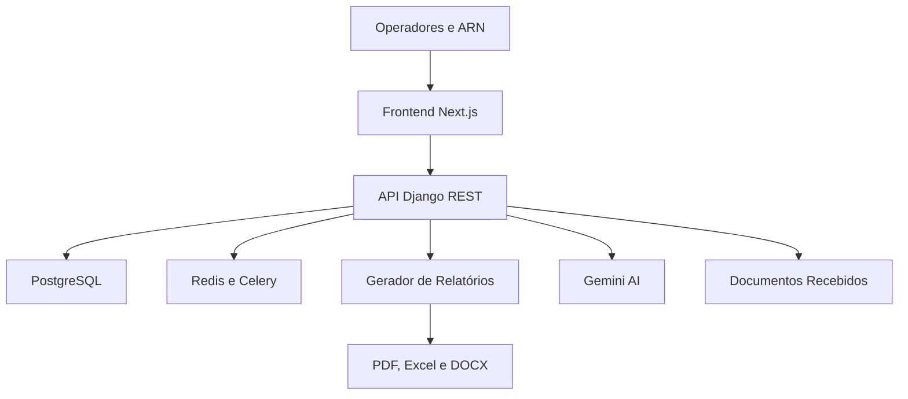
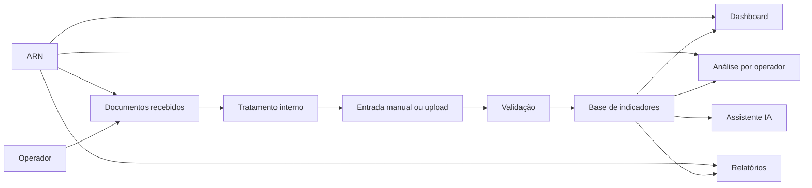

# Observatório ARN 2026

> Plataforma institucional para monitorização, análise e reporte do mercado de telecomunicações da Guiné-Bissau.

Última actualização: Maio de 2026.

O `Observatório ARN 2026` é uma aplicação web desenvolvida para a Autoridade Reguladora Nacional (ARN). Centraliza a recolha, tratamento documental, validação, análise e publicação interna de indicadores do sector das telecomunicações, com suporte a dados por operador, dashboards comparativos, relatórios trimestrais e anuais, exportação documental e assistente de análise com IA.

Ambiente público do frontend: [https://observatorio-arn-2026.vercel.app](https://observatorio-arn-2026.vercel.app)

## Visão Geral

O projecto responde a uma necessidade operacional da ARN: transformar ficheiros, entradas manuais e indicadores dispersos num sistema único, auditável e preparado para análise regulatória.

**Objectivos principais**

- centralizar indicadores de operadores de telecomunicações
- reduzir trabalho manual em folhas de cálculo
- organizar documentos recebidos dos operadores antes da importação
- permitir análise por operador, categoria, período e indicador
- produzir relatórios descritivos com gráficos e narrativa técnica
- apoiar a tomada de decisão com dashboards de mercado
- manter controlo de acesso por perfil de utilizador
- preparar a base para histórico plurianual e reporting institucional

**Operadores suportados**

| Operador | Tipo |
| --- | --- |
| Telecel | Operador móvel e terrestre |
| Orange Bissau | Operador móvel e terrestre |
| Starlink | Operador satélite e ISP |
| Outros | Agregação para indicadores fora dos operadores principais |

## Funcionalidades Implementadas

### Autenticação e perfis

- login com JWT
- refresh automático de sessão
- perfil do utilizador autenticado
- papéis para administração ARN, analistas ARN, operadores e visualizadores
- restrição de dados por operador quando aplicável
- criação automática de superuser em produção via variáveis de ambiente

### Entrada de dados

- entrada manual de indicadores
- escolha explícita de operadora na entrada manual
- filtragem de indicadores aplicáveis por tipo de operador
- importação de ficheiros Excel
- pipeline ETL com validação e histórico de uploads
- suporte a dados cumulativos e periódicos
- normalização de operadores, incluindo mapeamentos históricos como MTN para Telecel

### Documentos recebidos

- registo interno de questionários, resumos KPI e documentos de suporte recebidos
- associação por operador, ano, trimestre, tipo de documento e ficheiro original
- fila de tratamento com estados: recebido, em classificação, em extracção, em revisão, validado, importado e arquivado
- prioridade, prazo interno, responsável ARN e notas internas
- indicadores de gestão: total, documentos em aberto, atrasados e alta prioridade
- filtros por operador, ano e estado
- actualização rápida de estado e prioridade pela equipa ARN
- página de detalhe do documento com ficheiro original, notas internas e última importação
- envio do documento recebido para o pipeline de importação Excel existente
- ligação entre documento recebido e upload/importação, incluindo log de processamento

### Indicadores e períodos

- catálogo de categorias de indicadores
- períodos mensais, trimestrais e anuais
- relação entre indicadores e tipos de operador
- validação de valores por indicador
- suporte a indicadores de subscritores, tráfego, receitas, infraestrutura e mercado

### Dashboard

- resumo executivo com KPIs principais
- evolução temporal por indicador
- comparação entre operadores
- quotas de mercado
- HHI para leitura de concentração de mercado
- liderança por segmento
- tráfego de dados, internet fixa, assinaturas móveis e outros indicadores relevantes
- sidebar colapsável para melhor uso do espaço de trabalho

### Análise de dados

- análise por categoria
- filtro por operador
- visão isolada de Orange
- visão isolada de Telecel
- visão isolada de Starlink
- visão de Outros
- visão geral com todos os operadores
- comparativos por indicador, período e categoria

### Relatórios

- geração de relatórios por período
- relatórios gerais com todos os operadores
- relatórios isolados por Orange, Telecel, Starlink ou Outros
- exportação em PDF, Excel e DOCX
- gráficos integrados nos relatórios
- narrativa descritiva inspirada no modelo institucional da ARN
- indicadores, quotas, variações, concentração de mercado e leitura técnica
- preparação para lógica trimestral e anual

### Assistente IA

- assistente com Google Gemini
- contexto baseado nos dados do dashboard
- histórico de sessões e mensagens
- fallback quando a chave de IA não está configurada
- apoio a perguntas sobre indicadores e comportamento do mercado

### Exportação e ficheiros

- PDF com WeasyPrint
- Excel com openpyxl
- DOCX com python-docx
- armazenamento local em desenvolvimento
- suporte opcional a storage S3 compatível em produção

## Arquitectura



O repositório é um monorepo com backend Django e frontend Next.js.

```txt
.
├── backend/              # Django, DRF, modelos, serviços, relatórios e IA
├── frontend/             # Next.js, TypeScript, dashboard e interface
├── nginx/                # reverse proxy para ambiente Docker local
├── docker-compose.yml    # ambiente local completo
├── render.yaml           # Blueprint do backend e PostgreSQL no Render
├── vercel.json           # configuração do frontend na Vercel
└── start.sh              # script auxiliar para desenvolvimento local
```

## Stack Técnica

| Camada | Tecnologia |
| --- | --- |
| Frontend | Next.js 14, React 18, TypeScript |
| UI | Tailwind CSS, lucide-react |
| Gráficos | Apache ECharts |
| Estado cliente | Zustand |
| Backend | Django 5, Django REST Framework |
| Autenticação | Simple JWT |
| Base de dados | PostgreSQL 16 |
| Jobs | Celery, Redis |
| Relatórios | WeasyPrint, openpyxl, python-docx, matplotlib, seaborn |
| IA | Google Gemini |
| Deploy frontend | Vercel |
| Deploy backend | Render Docker Blueprint |
| Static files | WhiteNoise |
| Storage opcional | S3 compatível via django-storages |

## Como Executar Localmente

### Pré-requisitos

- Git
- Docker e Docker Compose
- Node.js 20 ou superior, quando executado fora do Docker
- Python 3.12, quando executado fora do Docker

### Ambiente com Docker

```bash
git clone https://github.com/atchutchi/Observatorio_ARN_2026.git
cd Observatorio_ARN_2026
cp .env.example .env
docker-compose up --build
```

Serviços locais:

| Serviço | URL |
| --- | --- |
| Frontend | [http://localhost:3000](http://localhost:3000) |
| Backend API | [http://localhost:8000/api/v1/](http://localhost:8000/api/v1/) |
| Health check | [http://localhost:8000/healthz/](http://localhost:8000/healthz/) |
| Django Admin | [http://localhost:8000/admin/](http://localhost:8000/admin/) |
| Nginx | [http://localhost](http://localhost) |

### Script local

O repositório inclui um script para acelerar o arranque em desenvolvimento.

```bash
./start.sh setup
./start.sh
```

Também é possível arrancar apenas uma parte:

```bash
./start.sh backend
./start.sh frontend
./start.sh stop
```

## Variáveis de Ambiente

Ver `.env.example` para a lista completa.

### Backend

| Variável | Uso |
| --- | --- |
| `DJANGO_SECRET_KEY` | chave secreta do Django |
| `DJANGO_SETTINGS_MODULE` | settings activos, por exemplo `config.settings.production` |
| `DJANGO_ALLOWED_HOSTS` | domínios autorizados pelo Django |
| `DATABASE_URL` | ligação PostgreSQL em produção |
| `FRONTEND_URL` | URL público do frontend |
| `CORS_ALLOWED_ORIGINS` | origens permitidas para chamadas API |
| `CSRF_TRUSTED_ORIGINS` | origens confiáveis para CSRF |
| `DJANGO_SUPERUSER_USERNAME` | username do admin criado no primeiro arranque |
| `DJANGO_SUPERUSER_EMAIL` | email do admin criado no primeiro arranque |
| `DJANGO_SUPERUSER_PASSWORD` | palavra-passe inicial do admin |
| `GEMINI_API_KEY` | chave opcional para assistente IA |
| `USE_S3_STORAGE` | activa storage S3 quando definido como `true` |
| `DATA_UPLOAD_PROCESS_SYNC` | processa uploads Excel de forma síncrona quando definido como `true` |
| `RUN_SEED_ON_STARTUP` | executa `seed_data` no arranque quando definido como `true` |
| `RUN_KPI_IMPORT_ON_STARTUP` | importa os ficheiros KPI JSON no arranque quando definido como `true` |
| `KPI_IMPORT_YEARS` | lista de anos a importar quando `RUN_KPI_IMPORT_ON_STARTUP=true` |

### Frontend

| Variável | Uso |
| --- | --- |
| `NEXT_PUBLIC_API_URL` | URL público da API, por exemplo `https://backend.onrender.com/api/v1` |
| `NEXT_PUBLIC_APP_NAME` | nome público da aplicação |

Em produção, `NEXT_PUBLIC_API_URL` deve apontar para o backend no Render, não para o domínio da Vercel.

## Deploy

### Frontend na Vercel

1. Ligar o repositório GitHub à Vercel.
2. Configurar o projecto para usar a pasta `frontend`.
3. Definir `NEXT_PUBLIC_API_URL` com o URL público do backend:

```txt
https://URL-DO-BACKEND.onrender.com/api/v1
```

4. Fazer redeploy depois de alterar variáveis `NEXT_PUBLIC_*`.

### Backend no Render

O backend é provisionado por Blueprint através de `render.yaml`.

O Blueprint cria:

- web service `observatorio-arn-backend`
- base PostgreSQL `observatorio-arn-db`
- variável `DATABASE_URL` ligada automaticamente à base
- `DJANGO_SECRET_KEY` gerada automaticamente
- health check em `/healthz/`

Variáveis a preencher manualmente no Render:

```txt
FRONTEND_URL=https://observatorio-arn-2026.vercel.app
CORS_ALLOWED_ORIGINS=https://observatorio-arn-2026.vercel.app
CSRF_TRUSTED_ORIGINS=https://observatorio-arn-2026.vercel.app
DJANGO_SUPERUSER_USERNAME=<utilizador-admin>
DJANGO_SUPERUSER_EMAIL=<email-admin>
DJANGO_SUPERUSER_PASSWORD=<password-forte>
GEMINI_API_KEY=<opcional>
```

Por defeito, o backend não reexecuta `seed_data` nem `import_kpi_json` em cada arranque. Isto evita cold starts longos no plano free do Render. Para reimportar dados históricos, activar temporariamente:

```txt
RUN_SEED_ON_STARTUP=true
RUN_KPI_IMPORT_ON_STARTUP=true
KPI_IMPORT_YEARS=2024 2021 2020 2019 2018
```

Depois do deploy/importação, voltar a definir `RUN_SEED_ON_STARTUP=false` e `RUN_KPI_IMPORT_ON_STARTUP=false`.

Depois do deploy, validar:

```txt
https://URL-DO-BACKEND.onrender.com/healthz/
```

Resposta esperada:

```json
{"status":"ok"}
```

## Comandos de Desenvolvimento

### Backend

```bash
cd backend
python manage.py makemigrations
python manage.py migrate
python manage.py seed_data
python manage.py test
```

### Frontend

```bash
cd frontend
npm install
npm run dev
npm run lint
npm run build
```

### Validação usada no projecto

```bash
cd frontend
npm run lint
npm run build
```

```bash
cd backend
USE_SQLITE=true ./venv/bin/python manage.py test apps.dashboards apps.reports apps.data_entry
USE_SQLITE=true ./venv/bin/python manage.py makemigrations --check --dry-run
```

## API Principal

Todos os endpoints principais estão sob `/api/v1/`.

| Área | Endpoints |
| --- | --- |
| Auth | `POST auth/token/`, `POST auth/token/refresh/`, `GET auth/profile/` |
| Utilizadores | `GET users/`, `PATCH auth/profile/` |
| Operadores | `GET operators/`, `GET operator-types/` |
| Indicadores | `GET indicator-categories/`, `GET indicators/`, `GET periods/` |
| Dados | `GET/POST data/`, `GET/POST cumulative-data/`, `POST uploads/` |
| Documentos | `GET/POST received-documents/`, `GET received-documents/summary/`, `POST received-documents/{id}/send_to_import/` |
| Dashboard | `GET dashboard/summary/`, `GET dashboard/market-share/`, `GET dashboard/trends/`, `GET dashboard/hhi/` |
| Relatórios | `GET reports/`, `POST reports/generate/`, downloads PDF, Excel e DOCX |
| Assistente | `POST assistant/query/`, `GET assistant/sessions/` |

## Modelo de Operação



## Segurança e Boas Práticas

- credenciais fora do código fonte
- variáveis sensíveis configuradas em Render e Vercel
- JWT para autenticação API
- CORS restrito ao frontend autorizado
- `ALLOWED_HOSTS` controlado por ambiente
- superuser criado por variáveis no primeiro arranque
- passwords iniciais devem ser alteradas depois do primeiro login
- ficheiros `.env*` não devem ser versionados
- dados reais e relatórios sensíveis não devem ser colocados em screenshots públicos

## Estado Actual

O produto já cobre o núcleo do observatório:

- autenticação
- documentos recebidos e fila interna de tratamento
- detalhe do documento com envio para importação e log do processamento
- entrada manual e importação de dados
- operadores e indicadores
- dashboard executivo
- análise por operador e por categoria
- relatórios por operador e geral
- exportações PDF, Excel e DOCX
- assistente IA
- deploy preparado para Vercel e Render

## Roadmap Técnico

- adicionar extracção assistida de tabelas dos questionários Excel
- criar checklist de qualidade por tipo de documento e operador
- reforçar testes E2E dos fluxos principais
- configurar storage persistente para ficheiros gerados em produção
- adicionar screenshots sanitizados ao README
- melhorar observabilidade de jobs e geração de relatórios
- ampliar histórico de indicadores plurianuais
- automatizar relatórios trimestrais e anuais recorrentes

## Repositórios de Referência

Este README segue uma abordagem mais operacional e profissional, alinhada com a documentação de projectos recentes do mesmo autor:

- [bidera_store](https://github.com/atchutchi/bidera_store)
- [abiptom-admin](https://github.com/atchutchi/abiptom-admin)

## Licença

Projecto institucional da Autoridade Reguladora Nacional (ARN) da Guiné-Bissau.

Desenvolvido por Atchutchi Ferreira para apoio à operação técnica e regulatória da ARN.
